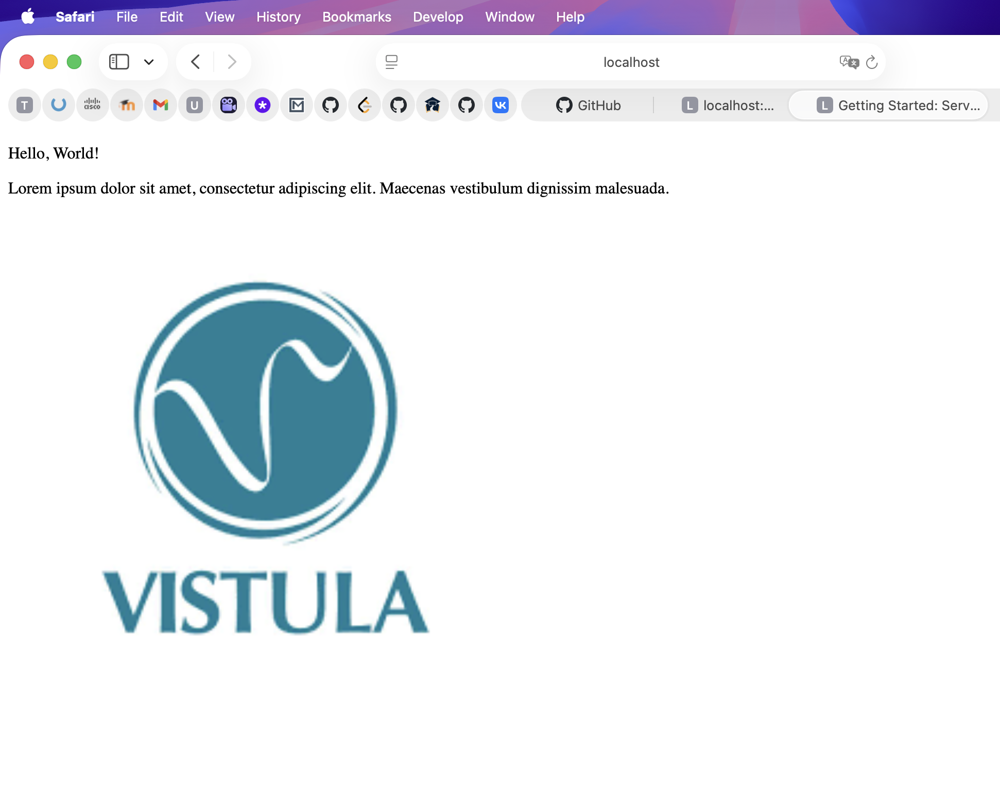
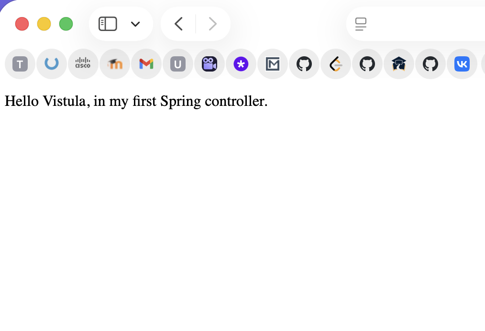

# Task 1 – Spring Boot Basics

This project is a simple Spring Boot application.
It demonstrates basic controllers and browser endpoints.

---

## Use Case 1 – Home Page

This screenshot shows the main page of the application opened in a browser.

---

## Use Case 2 – Hello Controller

This screenshot shows a simple Spring controller endpoint returning a text message.

