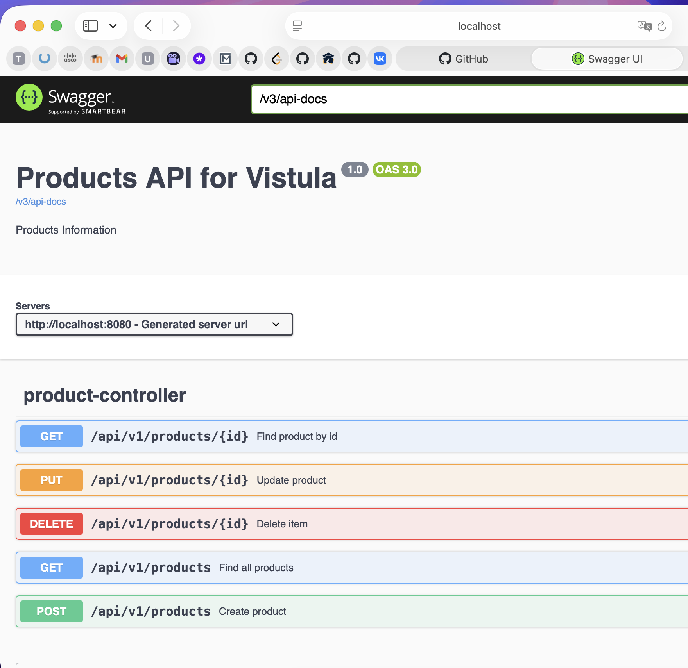
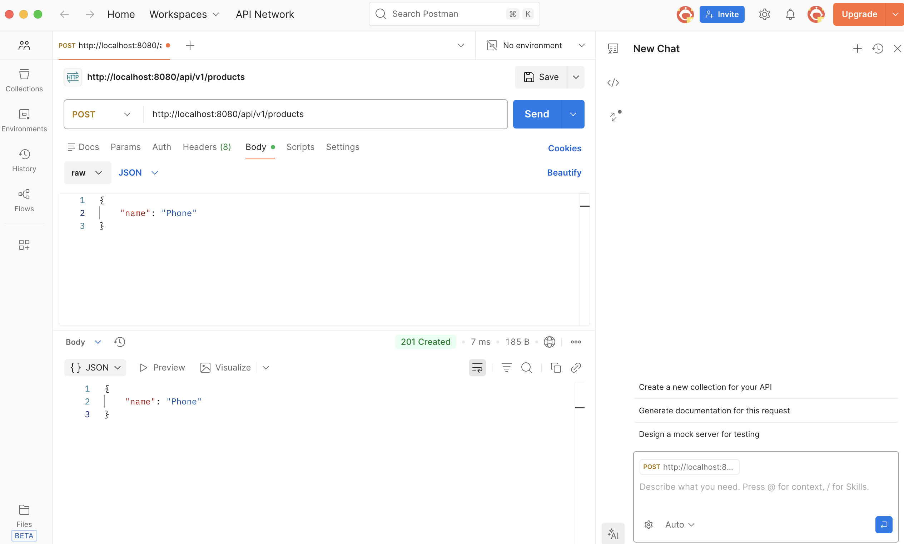
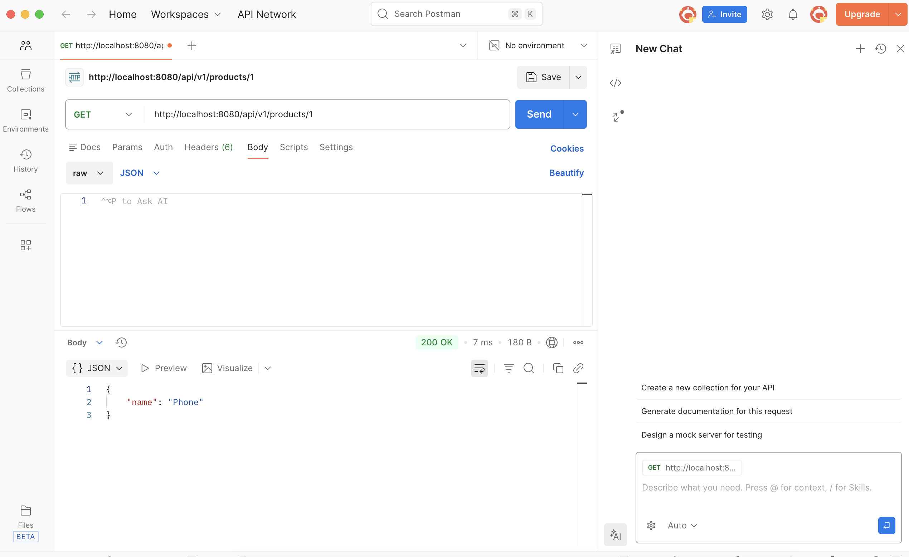
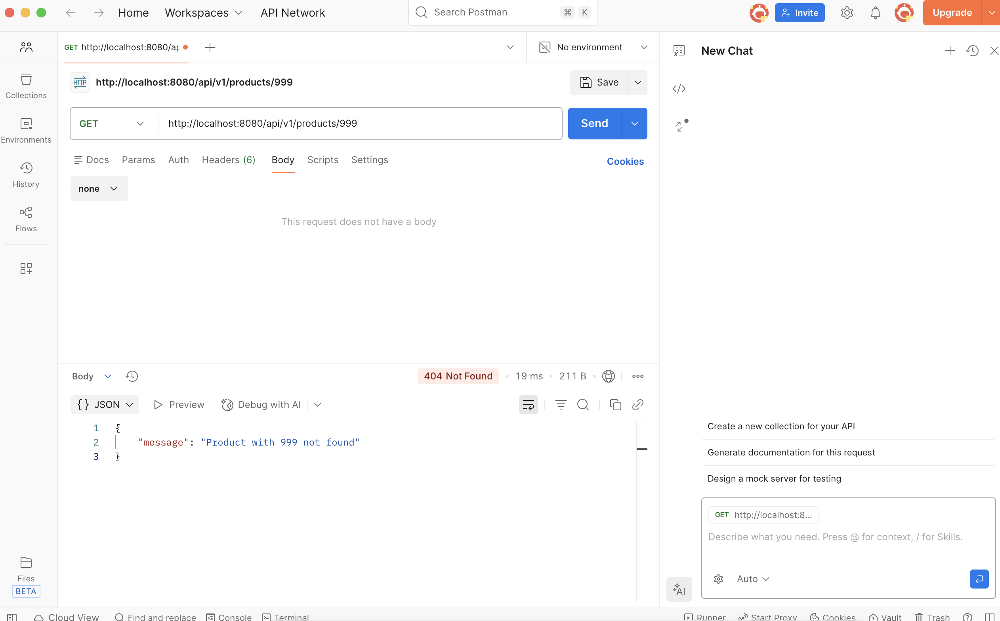
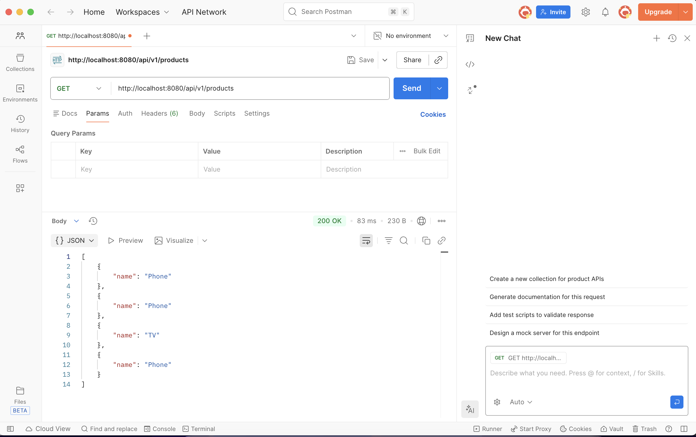
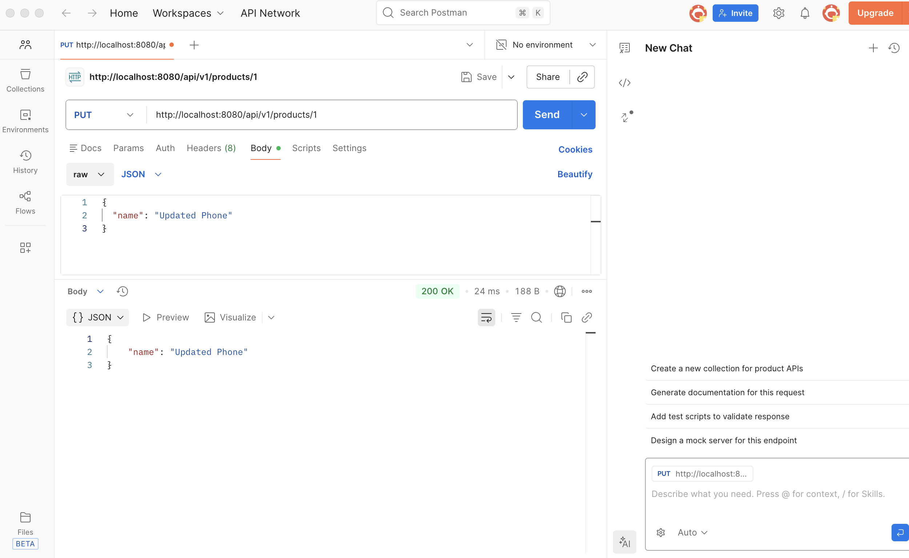
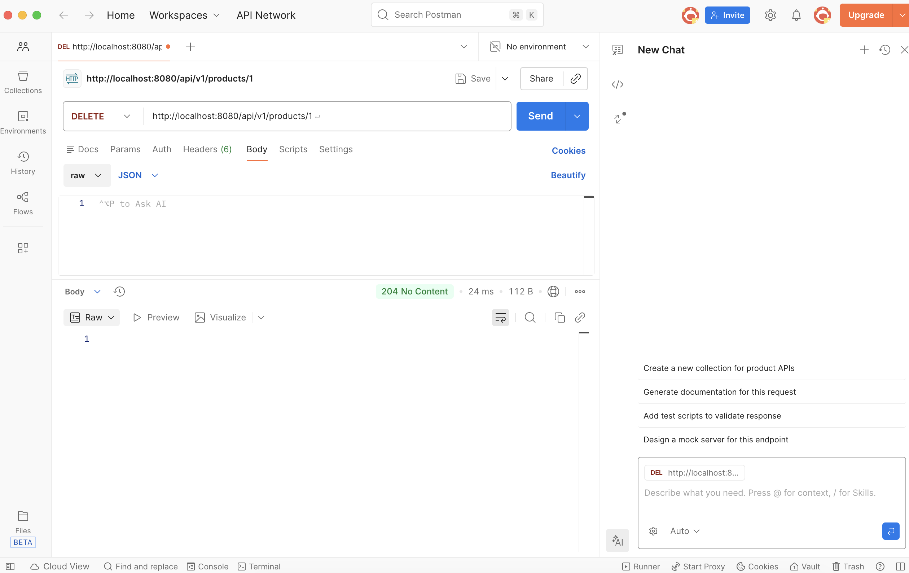
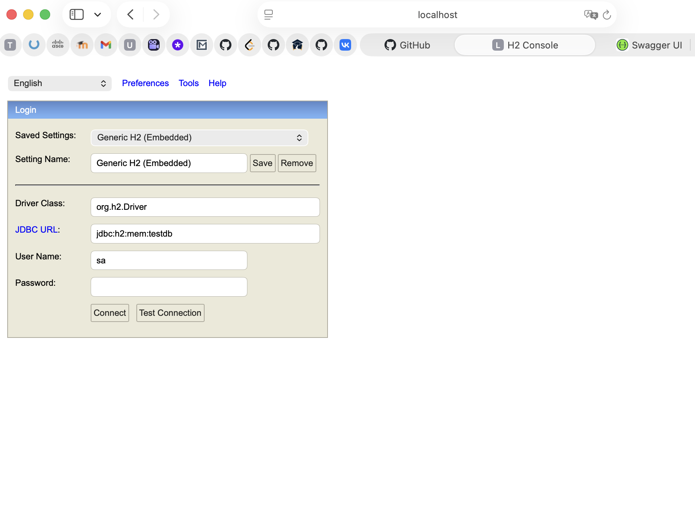
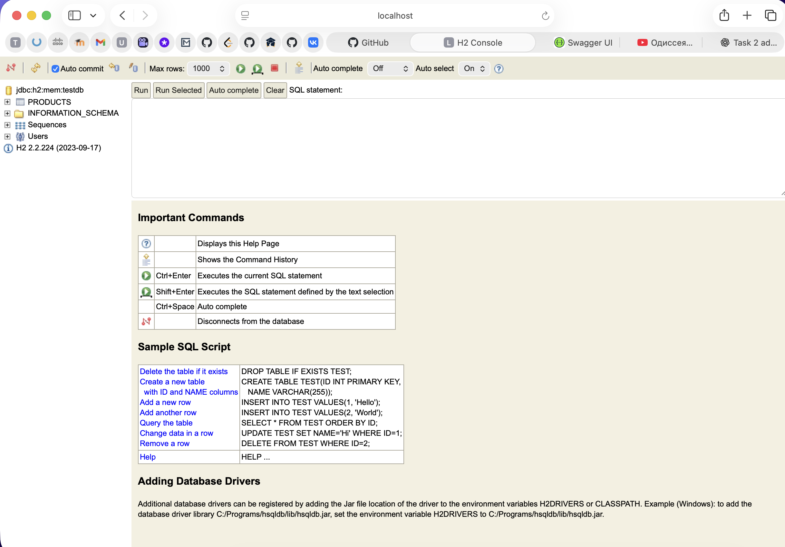
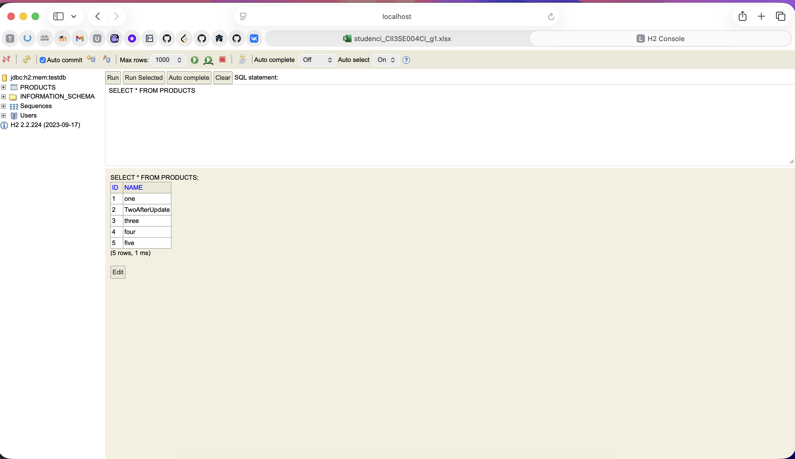

# Task 2 – REST API with Spring Boot

This project is a REST API created using Spring Boot.
All endpoints were tested using Postman and Swagger UI.

---

## Swagger UI
Swagger UI shows all available API endpoints.



---

## Create Product (POST)
A new product is created using Postman.



---

## Get Product by ID (200 OK)
A product is successfully retrieved by its ID.



---

## Get Product by ID (404 Not Found)
An error message is returned when the product does not exist.



---

## Get All Products
All products are returned as a list.



---

## Update Product (PUT)
An existing product is updated.



---

## Delete Product (DELETE)
A product is deleted by its ID.



---

## After Delete
The product is no longer available after deletion.


---

## H2 Database Console
H2 in-memory database and PRODUCTS table.




### Database Verification

The application was tested using the implemented REST endpoints.
To verify that the operations affected the database correctly, the following SQL query was executed in the H2 Console:

```sql
SELECT * FROM PRODUCTS;

